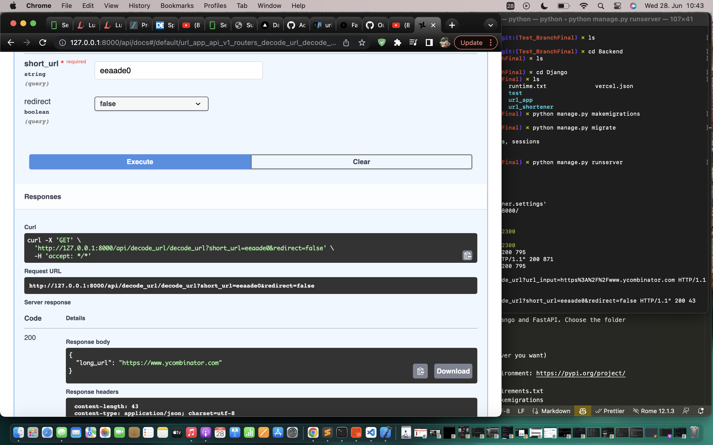
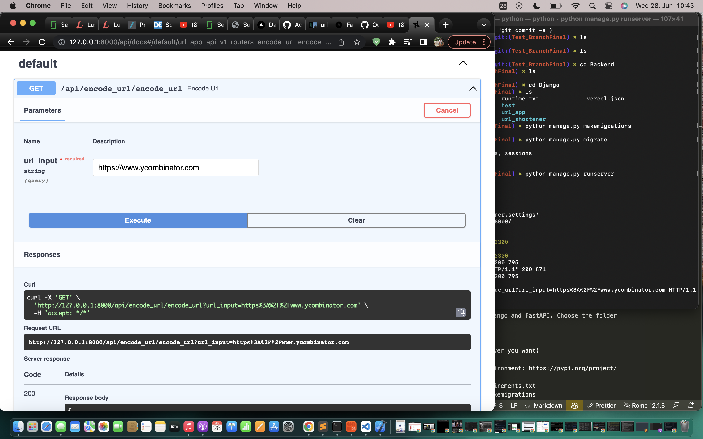

## See live in action:
   This project is a fullstack app with NextJS frontend and
   authentication implemented using Google Firebase.
   
   You can choose to run whichever backend you want: FastAPI or Django.
   I prefer Django because it has bigger support whereas FastAPI is faster
   if speed is needed. Both backends work equivalently.

   The frontend is live at: 
   https://url-shortening-service-1qcmlgxyq-oushesh.vercel.app/
   
   The Backend is deployed also by hacking on vercel so I don't 
   pay price for hosting.
   
   FastAPI Backend:
   
    with MongoDB database for production can be accessed from here (optional):
   https://github.com/Oushesh/url-shortening_service_fastapi_mongodb

   You can build the git and run locally and you will get the output.

   The Fast API Backend connected correctly with Frontend in NEXTJS 
   is under the folder FastAPI here deployed at: 
   
      * https://url-shortening-service-ol9j.vercel.app/docs#/

      You will see the API on Swagger UI. This api is connected to the 
      frontend.

   Django Backend:
   The Django Backend uses Ninja API with routers and schemas.
   It works similarly to the FastAPI.

   Follow the instructions below and you can run the backend Django locally
   and either test it on Swagger UI or with the frontend directly.

   For Django run the instructions below and you will can test it 
   on the browser at:

   http://127.0.0.1:8000/api/
   See the screenshot below:

   
   

   
## Installation:
   The frontend was entirely built using Tailwindcss, heroicons
   react-icons and Nextjs
   
   * FRONTEND:
      cd Frontend: 
      * yarn run build
      * yarn run start
      * for quick dev changes and seeing live results: yarn run dev
   
   Backend is built both on Django and FastAPI. Choose the folder
   you want. 

   * Backend: 
      cd Backend (choose whichever you want)
       * Django
         * Create a virtualenvironment: https://pypi.org/project/virtualenvwrapper/
         * pip install -r requirements.txt
         * python manage.py makemigrations
         * python manage.py migrate
         * python manage.py runserver

      * FastAPI:
       * Create a virtualenvironment: https://pypi.org/project/virtualenvwrapper/
       * pip install -r requirements.txt
       * make sure to install uvicorn as well
       * uvicorn main:app --reload
       
## RUN Docker: 
   * git clone https://github.com/Oushesh/url_shortening_service.git
   * Backend: 
     * Django: cd Backend/Django
       * docker compose up 
            -- This will build the docker file and runs the backend locally.
            -- This docker is for dev purposes usually my strategy of deploying is
               to have one Docker for dev and another one for prod. It speeds up
               development processs. 
      * FastAPI: cd Backend/

## RUN Classical:
   * git clone https://github.com/Oushesh/url_shortening_service.git
   
## How to perform the encoding part of the hash file and the decoding part?

## use the counter to increase the robustness of the encoding and decoding 
   part to increase hash frequency with a counter to avoid collision when the Hash MD5 is 

## My Development Philosophy and Style.
   CI/CD pipeline 
   * Django:    
   * FastAPI:

## Deployment:
   * Docker file. docker.yaml needed.
 
## Technical Debate on the url shortening service:
    * URL Shortening Logic (Encoding):
     The hashing I went for is MD5. People can use others like Base62 
     Encoding etc...

     The mD5 only uses 7 characters and the encoding produces 128bit characters. 
     To prevent collisoin we save the results in dictionary either in redis or 
     postgresql database (I prefer Supabase)

    The advantages is that this approach MD5 saves some space. Space
    (storage) is more expensive than compute for these kind of applications
    unless you are doing ML like which requires GPU compute.

    To solve the collision problem we will use a Counter from python library
    itertools. This will guarantee deduplication since the counter always 
    increases thus is unique. Appending the counter value at the end of the 
    md5 encoded string ensures no 2 strings are the same. 

   Also all encoded strings are saved in memory (cache) and checked
   before encoding and decoding. (no duplicate entries)
   
   For scalablity just use posgresql or redis database. During scaling
   we can use multiserver approach and also to ensure that in the 
   case one server fails  then another server (the counter) could
   have the same number. So instead every server has a range then can count
   upto and thus if one fails we ensure no overlap.

## Testing:
   I did not bother adding tests for the frontend for now
   For the backend:
   * FastAPI: 
      cd Backend/FastAPI:
      pytest
   
   * Django:
     cd Backend/Django:
     pytest
   
   Each test consists of 10-11 urls to be encoded and recovered to its original one.

   * main.yml github action runs the tests evoked by pytest when a different user or anyone makes a branch and commits to main.

   Test-run include: .github/workflow/main.yml (github actions)
   and git guardian secrets.

## Reference:
   * https://www.geeksforgeeks.org/system-design-url-shortening-service/

   